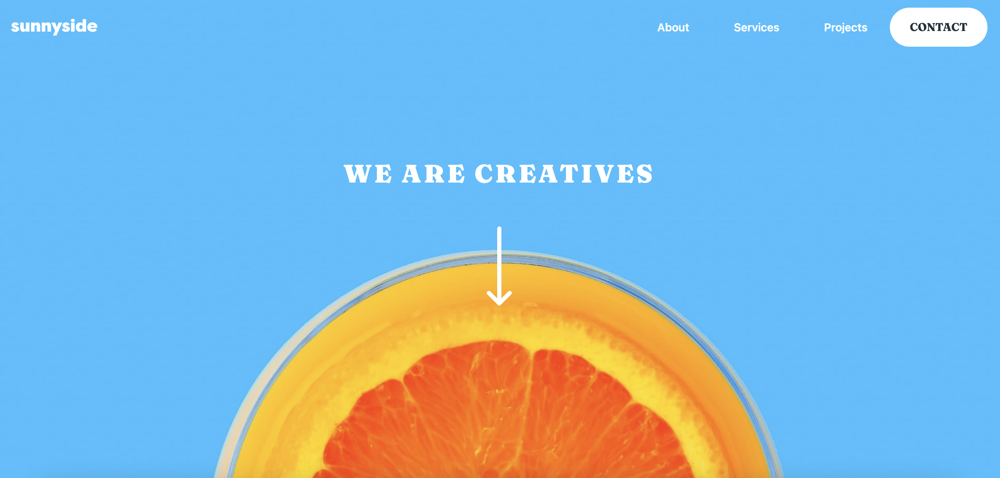

# Frontend Mentor - Sunnyside agency landing page solution

This is a solution to the [Sunnyside agency landing page challenge on Frontend Mentor](https://www.frontendmentor.io/challenges/sunnyside-agency-landing-page-7yVs3B6ef). Frontend Mentor challenges help you improve your coding skills by building realistic projects.

## Table of contents

- [Overview](#overview)
  - [The challenge](#the-challenge)
  - [Screenshot](#screenshot)
  - [Links](#links)
- [My process](#my-process)
  - [Built with](#built-with)
  - [What I learned](#what-i-learned)
- [Author](#author)

## Overview

### The challenge

Users should be able to:

- View the optimal layout for the site depending on their device's screen size
- See hover states for all interactive elements on the page

### Screenshot

### Links

- Solution URL: [https://www.frontendmentor.io/solutions/url-shortner-with-nextjs-and-tailwind-css-QYWfeMXlJB](https://www.frontendmentor.io/solutions/url-shortner-with-nextjs-and-tailwind-css-QYWfeMXlJB)
- Live Site URL: [https://shortly-gamma-bice.vercel.app/](https://shortly-gamma-bice.vercel.app/)

## My process

### Built with

- Semantic HTML5 markup
- CSS custom properties
- Flexbox
- CSS Grid
- Mobile-first workflow
- [React](https://reactjs.org/) - JS library
- [Next.js](https://nextjs.org/) - React framework

### What I learned

- How to use SVGs as React Component so to have full control on their properties
- Tailwind theme customisation

## Author

- Website - [https://angelo-ilardi.vercel.app/](https://angelo-ilardi.vercel.app/)
- Frontend Mentor - [@helldorado82](https://www.frontendmentor.io/profile/helldorado82)
